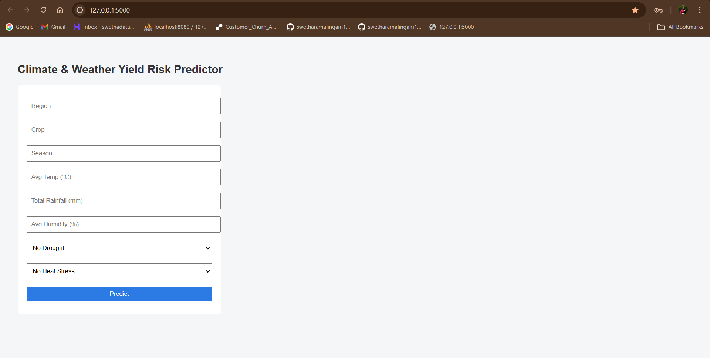
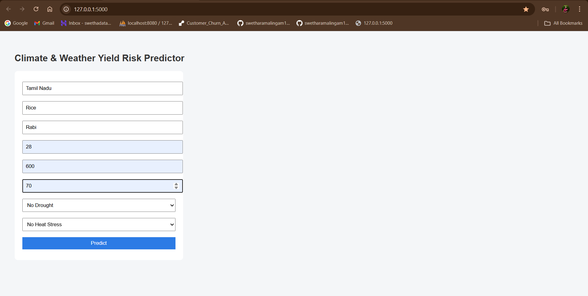
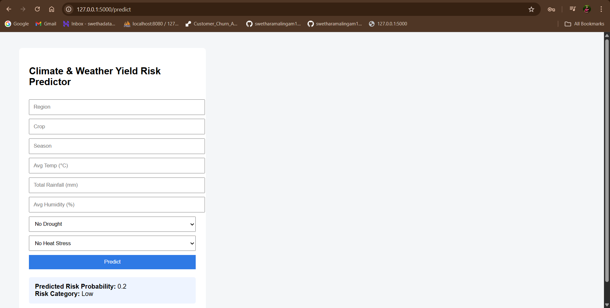

# Climate & Weather Impact on Agriculture 

## Overview
Climate and weather variability significantly influence agricultural productivity. Factors such as temperature, rainfall, humidity, droughts, and heat stress directly affect crop yields, planting decisions, and farm income.

This project builds an end-to-end **data analytics and machine learning solution** to quantify climate impacts on agriculture and provide **actionable risk insights** through a deployed Flask web application.

The final output includes data processing pipelines, predictive models, visual analytics, and an interactive web interface for stakeholders.


## Problem Statement
Farmers and agribusinesses often struggle to translate raw climate and weather data into meaningful decisions.

Key challenges include:
- Unclear impact of weather anomalies on crop yield
- Poorly timed planting and irrigation decisions
- Reactive handling of drought and heat stress
- Lack of simple tools to access predictive insights

This project addresses these gaps by linking climate variables to crop yield risk and delivering predictions through a user-friendly web app.

---

## Objectives
- Quantify the impact of climate and weather variables on crop yield risk
- Predict low-yield risk probability for a given crop-season scenario
- Provide decision-support insights for farmers and agronomists
- Build a reproducible analytics pipeline with deployment readiness

---

## Data & Features
### Weather & Climate Inputs
- Average temperature (°C)
- Total rainfall (mm)
- Average humidity (%)
- Drought flag
- Heat stress flag

### Agricultural Inputs
- Region
- Crop
- Season

### Target
- **Low Yield Risk Probability**
- **Risk Category** (Low / Medium / High)

---

## Methodology
1. **Data Cleaning & Preparation**
   - Standardized weather and crop data
   - Handled missing values and inconsistent units

2. **Feature Engineering**
   - Seasonal weather aggregation
   - Stress indicators for drought and heat

3. **Exploratory Data Analysis (EDA)**
   - Trend and distribution analysis
   - Weather–yield relationship exploration

4. **Modeling**
   - Machine learning pipeline trained to predict yield risk
   - Model persisted using `joblib`

5. **Deployment**
   - Flask web application with form-based input
   - Real-time prediction and risk categorization

---

## Flask Web Application
The project includes a lightweight Flask app that allows users to:
- Enter crop and weather details
- Click **Predict**
- Instantly view:
  - Risk probability
  - Risk category (Low / Medium / High)

  ## Web Application Screenshots

### Home Page – User Input Form


### Filled Input Example


### Prediction Output



### Application Structure
P2_climate_weather_agriculture/
│
├── app.py
├── model_pipeline.pkl
├── requirements.txt
├── templates/
│ └── index.html
├── notebooks/
│ └── eda_and_model.ipynb
├── outputs/
│ ├── farm_risk_scores.csv
│ └── seasonal_yield_forecasts.csv
└── README.md

---

## How to Run Locally
```bash
pip install -r requirements.txt
python app.py
Open browser and visit:

http://127.0.0.1:5000

### Outputs
Web App: Interactive crop yield risk predictor

Model Artifact: model_pipeline.pkl

CSV Outputs:

Seasonal yield forecasts

Farm-level risk scores

EDA Visualizations for analysis and reporting

Use Cases
Farmers: planting and irrigation planning

Agronomists: advisory and risk assessment

Agribusinesses: yield and supply risk analysis

Insurers: climate-linked risk modeling

Policy planners: regional risk evaluation

Tools & Technologies
Python (Pandas, NumPy, Scikit-learn)

Matplotlib, Seaborn

Flask

Power BI (for dashboards)

Joblib (model persistence)

Limitations & Future Scope
Uses historical climate data; real-time IoT integration not included

Models are region and crop specific

Future extensions:

Multi-crop support

Time-series forecasting (30/60/90 days)

Remote sensing integration (NDVI)

API-based access for mobile apps

Author
Swetha R
Data Analyst | Climate & Agricultural Analytics